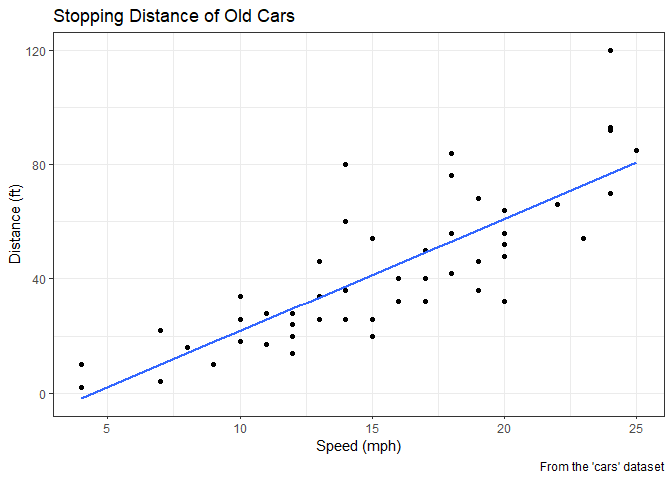
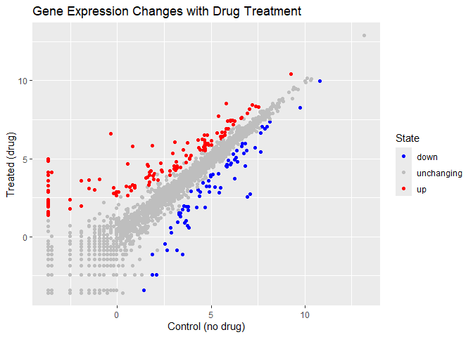
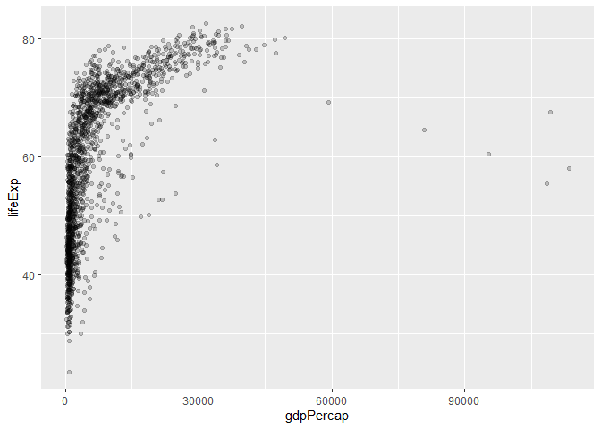
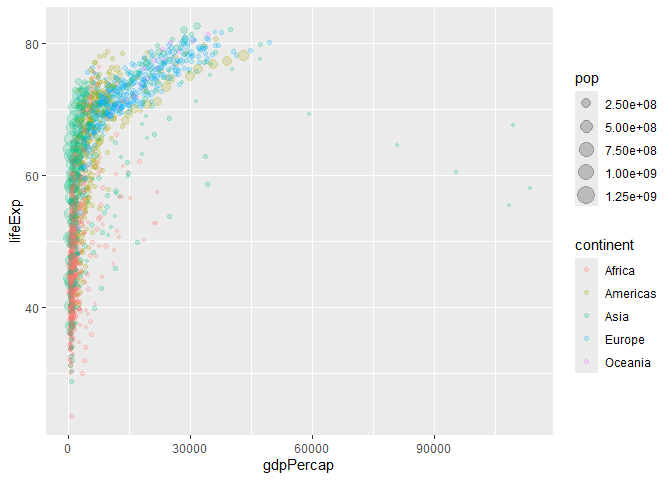
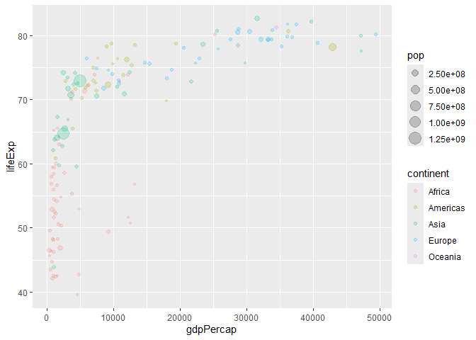
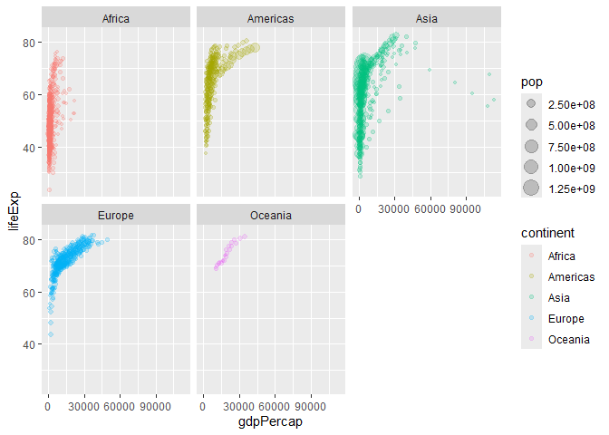

# Class 5: Data Visualization with ggplot
Yvonne Yu (A16333006)

- [A more complicated scatter plot](#a-more-complicated-scatter-plot)
- [Exploring the gapmider dataset](#exploring-the-gapmider-dataset)

Today we will have our first play with the **ggplot2** package - one of
the most popular graphics package son the planet.

There are amny plotting systems in R. These include so called *“base”*
plotting/graphics.

``` r
plot(cars)
```


Base plot is generally rather short code and somewhat dull plots ~ but
it is always there for you and is fast for big data sets.

If I want to use **ggplot2** it takes some more work.

``` r
# ggplot(cars)
```

I need to install the package first to my computer. To do this I can use
the function `install.packages(ggplot2)`

Every time I want to use a pacakage I need to load it up with a
`library()` call.

``` r
# install.packages(ggplot2)
library(ggplot2)
```

Now finally I can use ggplot

``` r
ggplot(cars)
```


Every ggplot has at least 3 things:

- **data** (the data.frame with the data you want to plot)
- **aes** (the aesthetic mapping of the data to the plot)
- **geom** (how do you want the plot to look, points, lines, etc.)

``` r
head(cars)
```

      speed dist
    1     4    2
    2     4   10
    3     7    4
    4     7   22
    5     8   16
    6     9   10

``` r
ggplot(cars) +
  aes(x = speed, y = dist) +
  geom_point() 
```


``` r
ggplot(cars) +
  aes(x = speed, y = dist) +
  geom_point() + geom_smooth()
```

    `geom_smooth()` using method = 'loess' and formula = 'y ~ x'


I want a liner model and no standard error bounds shown.

``` r
bp<- ggplot(cars) + aes(x = speed, y = dist) + geom_point()
```

``` r
bp + geom_smooth(se = FALSE, method = "lm") + 
  labs(title = "Stopping Distance of Old Cars", 
       x = "Speed (mph)", y = "Distance (ft)", 
       caption = "From the 'cars' dataset") + theme_bw()
```

    `geom_smooth()` using formula = 'y ~ x'



## A more complicated scatter plot

Here we make a plot of gene expression data:

``` r
url <- "https://bioboot.github.io/bimm143_S20/class-material/up_down_expression.txt"
genes <- read.delim(url)
```

``` r
head(genes)
```

            Gene Condition1 Condition2      State
    1      A4GNT -3.6808610 -3.4401355 unchanging
    2       AAAS  4.5479580  4.3864126 unchanging
    3      AASDH  3.7190695  3.4787276 unchanging
    4       AATF  5.0784720  5.0151916 unchanging
    5       AATK  0.4711421  0.5598642 unchanging
    6 AB015752.4 -3.6808610 -3.5921390 unchanging

``` r
nrow(genes)
```

    [1] 5196

``` r
colnames(genes)
```

    [1] "Gene"       "Condition1" "Condition2" "State"     

``` r
ncol(genes)
```

    [1] 4

``` r
table(genes$State)
```


          down unchanging         up 
            72       4997        127 

``` r
round(table(genes$State)[3]/ nrow(genes) * 100, 2)
```

      up 
    2.44 

``` r
n.gene <- nrow(genes)
n.up <- sum(genes$State == "up")

up.percent <- n.up/n.gene * 100
round(up.percent, 2)
```

    [1] 2.44

``` r
t <- ggplot(genes) + aes(x=Condition1, 
                         y=Condition2, col = State) + geom_point()
```

Change the colors and the labels that were provided for the plot.

``` r
t + scale_colour_manual(values = c("blue", "grey", "red")) + 
  labs(title = "Gene Expression Changes with Drug Treatment", 
       x= "Control (no drug)", y= "Treated (drug)")
```



## Exploring the gapmider dataset

Here we will load up the gapmider dataset to get practice with different
aes mappings.

``` r
url <- "https://raw.githubusercontent.com/jennybc/gapminder/master/inst/extdata/gapminder.tsv"

gapmider <- read.delim(url)
```

> Q. How many entries rows are in this dataset?

``` r
nrow(gapmider)
```

    [1] 1704

> Q. How many columns are in this dataset?

``` r
ncol(gapmider)
```

    [1] 6

``` r
dim(gapmider)
```

    [1] 1704    6

``` r
head(gapmider)
```

          country continent year lifeExp      pop gdpPercap
    1 Afghanistan      Asia 1952  28.801  8425333  779.4453
    2 Afghanistan      Asia 1957  30.332  9240934  820.8530
    3 Afghanistan      Asia 1962  31.997 10267083  853.1007
    4 Afghanistan      Asia 1967  34.020 11537966  836.1971
    5 Afghanistan      Asia 1972  36.088 13079460  739.9811
    6 Afghanistan      Asia 1977  38.438 14880372  786.1134

``` r
table(gapmider$year)
```


    1952 1957 1962 1967 1972 1977 1982 1987 1992 1997 2002 2007 
     142  142  142  142  142  142  142  142  142  142  142  142 

> Q. How many continents?

``` r
table(gapmider$continent)
```


      Africa Americas     Asia   Europe  Oceania 
         624      300      396      360       24 

I could use the `unique()` function…

``` r
length(unique(gapmider$continent))
```

    [1] 5

> Q. How many countries are there in this dataset?

``` r
# unique(gapmider$country)
length(unique(gapmider$country))
```

    [1] 142

``` r
ggplot(gapmider) + aes(x = gdpPercap, y = lifeExp) + 
  geom_point(alpha = 0.2)
```



``` r
ggplot(gapmider) + aes(x = gdpPercap, y = lifeExp, 
                       col = continent, size = pop) + 
  geom_point(alpha = 0.2)
```



``` r
library(dplyr)
```


    Attaching package: 'dplyr'

    The following objects are masked from 'package:stats':

        filter, lag

    The following objects are masked from 'package:base':

        intersect, setdiff, setequal, union

``` r
gapminder_2007 <- gapmider %>% filter(year==2007)

head(gapminder_2007)
```

          country continent year lifeExp      pop  gdpPercap
    1 Afghanistan      Asia 2007  43.828 31889923   974.5803
    2     Albania    Europe 2007  76.423  3600523  5937.0295
    3     Algeria    Africa 2007  72.301 33333216  6223.3675
    4      Angola    Africa 2007  42.731 12420476  4797.2313
    5   Argentina  Americas 2007  75.320 40301927 12779.3796
    6   Australia   Oceania 2007  81.235 20434176 34435.3674

Plot of 2007 with population and continent data

``` r
ggplot(gapminder_2007) + aes(x = gdpPercap, 
                             y = lifeExp, col = continent, 
                             size = pop) + 
  geom_point(alpha = 0.2)
```



``` r
ggplot(gapmider) + aes(x = gdpPercap, y = lifeExp, 
                       col = continent, size = pop) + 
  geom_point(alpha = 0.2) + facet_wrap(~continent)
```


