# Class 9: Candy Analysis Mini Project
Yvonne Yu (A16333006)

In today’s class we will examine some data about candy from the 538
website.

\##Import Data

``` r
candy_file <- "https://raw.githubusercontent.com/fivethirtyeight/data/master/candy-power-ranking/candy-data.csv"

candy <- read.csv(candy_file, row.names = 1)
head(candy)
```

                 chocolate fruity caramel peanutyalmondy nougat crispedricewafer
    100 Grand            1      0       1              0      0                1
    3 Musketeers         1      0       0              0      1                0
    One dime             0      0       0              0      0                0
    One quarter          0      0       0              0      0                0
    Air Heads            0      1       0              0      0                0
    Almond Joy           1      0       0              1      0                0
                 hard bar pluribus sugarpercent pricepercent winpercent
    100 Grand       0   1        0        0.732        0.860   66.97173
    3 Musketeers    0   1        0        0.604        0.511   67.60294
    One dime        0   0        0        0.011        0.116   32.26109
    One quarter     0   0        0        0.011        0.511   46.11650
    Air Heads       0   0        0        0.906        0.511   52.34146
    Almond Joy      0   1        0        0.465        0.767   50.34755

\##Data Exploration

> Q1. How many different candy types are in this dataset?

``` r
nrow(candy)
```

    [1] 85

There are 85 candy types in the dataset.

> Q2. How many fruity candy types are in the dataset?

``` r
sum(candy$fruity)
```

    [1] 38

There are 38 fruity candy types in the dataset.

> Q. How many chocolate cnadys are in the dataset?

``` r
sum(candy$chocolate)
```

    [1] 37

There are 37 fruity candy types in the dataset.

## My favorite candy vs yours

> Q3. What is your favorite candy in the dataset and what is it’s
> winpercent value?

``` r
candy["Haribo Gold Bears",]$winpercent
```

    [1] 57.11974

``` r
candy["Welch's Fruit Snacks",]$winpercent
```

    [1] 44.37552

> Q4. What is the winpercent value for “Kit Kat”?

``` r
candy["Kit Kat",]$winpercent
```

    [1] 76.7686

> Q5. What is the winpercent value for “Tootsie Roll Snack Bars”?

``` r
candy["Tootsie Roll Snack Bars",]$winpercent
```

    [1] 49.6535

``` r
skimr::skim(candy)
```

|                                                  |       |
|:-------------------------------------------------|:------|
| Name                                             | candy |
| Number of rows                                   | 85    |
| Number of columns                                | 12    |
| \_\_\_\_\_\_\_\_\_\_\_\_\_\_\_\_\_\_\_\_\_\_\_   |       |
| Column type frequency:                           |       |
| numeric                                          | 12    |
| \_\_\_\_\_\_\_\_\_\_\_\_\_\_\_\_\_\_\_\_\_\_\_\_ |       |
| Group variables                                  | None  |

Data summary

**Variable type: numeric**

| skim_variable    | n_missing | complete_rate |  mean |    sd |    p0 |   p25 |   p50 |   p75 |  p100 | hist  |
|:-----------------|----------:|--------------:|------:|------:|------:|------:|------:|------:|------:|:------|
| chocolate        |         0 |             1 |  0.44 |  0.50 |  0.00 |  0.00 |  0.00 |  1.00 |  1.00 | ▇▁▁▁▆ |
| fruity           |         0 |             1 |  0.45 |  0.50 |  0.00 |  0.00 |  0.00 |  1.00 |  1.00 | ▇▁▁▁▆ |
| caramel          |         0 |             1 |  0.16 |  0.37 |  0.00 |  0.00 |  0.00 |  0.00 |  1.00 | ▇▁▁▁▂ |
| peanutyalmondy   |         0 |             1 |  0.16 |  0.37 |  0.00 |  0.00 |  0.00 |  0.00 |  1.00 | ▇▁▁▁▂ |
| nougat           |         0 |             1 |  0.08 |  0.28 |  0.00 |  0.00 |  0.00 |  0.00 |  1.00 | ▇▁▁▁▁ |
| crispedricewafer |         0 |             1 |  0.08 |  0.28 |  0.00 |  0.00 |  0.00 |  0.00 |  1.00 | ▇▁▁▁▁ |
| hard             |         0 |             1 |  0.18 |  0.38 |  0.00 |  0.00 |  0.00 |  0.00 |  1.00 | ▇▁▁▁▂ |
| bar              |         0 |             1 |  0.25 |  0.43 |  0.00 |  0.00 |  0.00 |  0.00 |  1.00 | ▇▁▁▁▂ |
| pluribus         |         0 |             1 |  0.52 |  0.50 |  0.00 |  0.00 |  1.00 |  1.00 |  1.00 | ▇▁▁▁▇ |
| sugarpercent     |         0 |             1 |  0.48 |  0.28 |  0.01 |  0.22 |  0.47 |  0.73 |  0.99 | ▇▇▇▇▆ |
| pricepercent     |         0 |             1 |  0.47 |  0.29 |  0.01 |  0.26 |  0.47 |  0.65 |  0.98 | ▇▇▇▇▆ |
| winpercent       |         0 |             1 | 50.32 | 14.71 | 22.45 | 39.14 | 47.83 | 59.86 | 84.18 | ▃▇▆▅▂ |

> Q6. Is there any variable/column that looks to be on a different scale
> to the majority of the other columns in the dataset?

The variable that looks like to be at a different scale is the
winpercent, in which it looks like the scale is from 0 to 100.

> Q7. What do you think a zero and one represent for the
> candy\$chocolate column?

The zero represents that the candy type does not fall under the
chocolate column, while the one represents that the candy type does fall
under the chocolate column.

> Q8. Plot a histogram of winpercent values.

``` r
library(ggplot2)
ggplot(candy, aes(winpercent)) + geom_histogram()
```

    `stat_bin()` using `bins = 30`. Pick better value with `binwidth`.


``` r
ggplot(candy, aes(winpercent)) + geom_histogram(bins = 7)
```

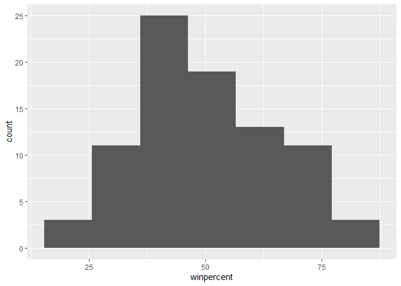

> Q9. Is the distribution of winpercent values symmetrical?

The distribution of the winpercent values are not symmetrical, skewed
left a little bit.

> Q10. Is the center of the distribution above or below 50%

``` r
mean(candy$winpercent)
```

    [1] 50.31676

``` r
summary(candy$winpercent)
```

       Min. 1st Qu.  Median    Mean 3rd Qu.    Max. 
      22.45   39.14   47.83   50.32   59.86   84.18 

The mean of the distribution is above 50%, but the median is below 50%.

> Q11. On average is chocolate candy higher or lower ranked than fruit
> candy?

Steps to solve this:

- First find all chocolate candy

- Find their winpercent values

- calculate the mean

- then do the same for the fruity candy and compare with the mean for
  the chocolate candy

``` r
chocolate.inds <- candy$chocolate ==1
chocolate.win <- candy[chocolate.inds, ]$winpercent
mean(chocolate.win)
```

    [1] 60.92153

``` r
fruity.inds <- candy$fruity == 1
fruity.win <- candy[fruity.inds,]$winpercent
mean(fruity.win)
```

    [1] 44.11974

Mean for chocolate: 60.92153, Mean for fruity: 44.11974

Chocolate candy on average is rated higher than fruity.

> Q12. Is this difference statistically significant?

``` r
t.test(chocolate.win, fruity.win)
```


        Welch Two Sample t-test

    data:  chocolate.win and fruity.win
    t = 6.2582, df = 68.882, p-value = 2.871e-08
    alternative hypothesis: true difference in means is not equal to 0
    95 percent confidence interval:
     11.44563 22.15795
    sample estimates:
    mean of x mean of y 
     60.92153  44.11974 

Yes

> Q13. What are the five least liked candy types in this set?

``` r
x <- c(5,6,4)
sort(x)
```

    [1] 4 5 6

``` r
x[order(x)]
```

    [1] 4 5 6

The order function returns the indices that make the input sorted.

``` r
inds <- order(candy$winpercent)
head(candy[inds,], 5)
```

                       chocolate fruity caramel peanutyalmondy nougat
    Nik L Nip                  0      1       0              0      0
    Boston Baked Beans         0      0       0              1      0
    Chiclets                   0      1       0              0      0
    Super Bubble               0      1       0              0      0
    Jawbusters                 0      1       0              0      0
                       crispedricewafer hard bar pluribus sugarpercent pricepercent
    Nik L Nip                         0    0   0        1        0.197        0.976
    Boston Baked Beans                0    0   0        1        0.313        0.511
    Chiclets                          0    0   0        1        0.046        0.325
    Super Bubble                      0    0   0        0        0.162        0.116
    Jawbusters                        0    1   0        1        0.093        0.511
                       winpercent
    Nik L Nip            22.44534
    Boston Baked Beans   23.41782
    Chiclets             24.52499
    Super Bubble         27.30386
    Jawbusters           28.12744

> Q14. What are the top 5 all time favority candy types out of this set?

``` r
tail(candy[inds,], 5)
```

                              chocolate fruity caramel peanutyalmondy nougat
    Snickers                          1      0       1              1      1
    Kit Kat                           1      0       0              0      0
    Twix                              1      0       1              0      0
    Reese's Miniatures                1      0       0              1      0
    Reese's Peanut Butter cup         1      0       0              1      0
                              crispedricewafer hard bar pluribus sugarpercent
    Snickers                                 0    0   1        0        0.546
    Kit Kat                                  1    0   1        0        0.313
    Twix                                     1    0   1        0        0.546
    Reese's Miniatures                       0    0   0        0        0.034
    Reese's Peanut Butter cup                0    0   0        0        0.720
                              pricepercent winpercent
    Snickers                         0.651   76.67378
    Kit Kat                          0.511   76.76860
    Twix                             0.906   81.64291
    Reese's Miniatures               0.279   81.86626
    Reese's Peanut Butter cup        0.651   84.18029

> Q15. Make a first barplot of candy ranking based on winpercent values.

``` r
ggplot(candy, aes(winpercent, rownames(candy))) + geom_col()
```


> Q16. This is quite ugly, use the `reorder()` function to get the bars
> sorted by winpercent?

``` r
#this would extend the height of the figure within ggplot

#| fig-height: 10
#| fig-width: 7

ggplot(candy, aes(winpercent, reorder(rownames(candy), winpercent))) + geom_col()
```


``` r
ggsave("mybarplot.png", height = 10)
```

    Saving 7 x 10 in image

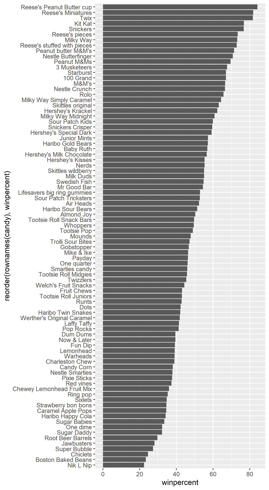

Add my custom colors to my barplot

``` r
my_cols = rep("grey", nrow(candy))
my_cols[candy$fruity == 1] <- "pink"
my_cols 
```

     [1] "grey" "grey" "grey" "grey" "pink" "grey" "grey" "grey" "grey" "pink"
    [11] "grey" "pink" "pink" "pink" "pink" "pink" "pink" "pink" "pink" "grey"
    [21] "pink" "pink" "grey" "grey" "grey" "grey" "pink" "grey" "grey" "pink"
    [31] "pink" "pink" "grey" "grey" "pink" "grey" "grey" "grey" "grey" "grey"
    [41] "grey" "pink" "grey" "grey" "pink" "pink" "grey" "grey" "grey" "pink"
    [51] "pink" "grey" "grey" "grey" "grey" "pink" "grey" "grey" "pink" "grey"
    [61] "pink" "pink" "grey" "pink" "grey" "grey" "pink" "pink" "pink" "pink"
    [71] "grey" "grey" "pink" "pink" "pink" "grey" "grey" "grey" "pink" "grey"
    [81] "pink" "pink" "pink" "grey" "grey"

``` r
#| fig-height: 10
#| fig-width: 7

ggplot(candy, aes(winpercent, reorder(rownames(candy), winpercent))) + geom_col(fill = my_cols)
```

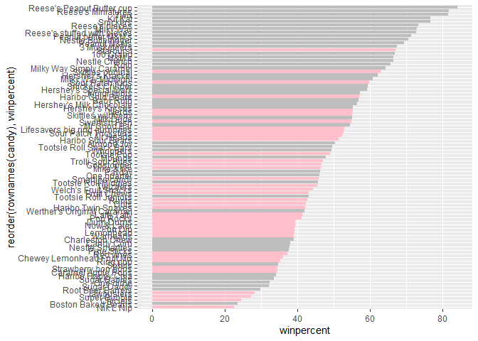

``` r
my_cols = rep("grey", nrow(candy))
my_cols[candy$fruity == 1] <- "pink"
my_cols[candy$chocolate == 1] <- "chocolate"
my_cols[candy$bar == 1] <- "brown"
my_cols
```

     [1] "brown"     "brown"     "grey"      "grey"      "pink"      "brown"    
     [7] "brown"     "grey"      "grey"      "pink"      "brown"     "pink"     
    [13] "pink"      "pink"      "pink"      "pink"      "pink"      "pink"     
    [19] "pink"      "grey"      "pink"      "pink"      "chocolate" "brown"    
    [25] "brown"     "brown"     "pink"      "chocolate" "brown"     "pink"     
    [31] "pink"      "pink"      "chocolate" "chocolate" "pink"      "chocolate"
    [37] "brown"     "brown"     "brown"     "brown"     "brown"     "pink"     
    [43] "brown"     "brown"     "pink"      "pink"      "brown"     "chocolate"
    [49] "grey"      "pink"      "pink"      "chocolate" "chocolate" "chocolate"
    [55] "chocolate" "pink"      "chocolate" "grey"      "pink"      "chocolate"
    [61] "pink"      "pink"      "chocolate" "pink"      "brown"     "brown"    
    [67] "pink"      "pink"      "pink"      "pink"      "grey"      "grey"     
    [73] "pink"      "pink"      "chocolate" "chocolate" "chocolate" "brown"    
    [79] "pink"      "brown"     "pink"      "pink"      "pink"      "grey"     
    [85] "chocolate"

``` r
ggplot(candy, aes(winpercent, reorder(rownames(candy), winpercent))) + geom_col(fill = my_cols)
```

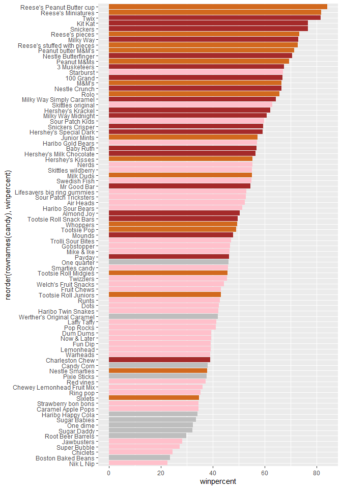

> Q17. What is the worst ranked chocolate candy?

Sixlets

> Q18. What is the best ranked fruity candy

Starburst

Plot of winpercent vs pricepercent

``` r
my_cols = rep("black", nrow(candy))
my_cols[candy$fruity == 1] <- "red"
my_cols[candy$chocolate == 1] <- "chocolate"
my_cols[candy$bar == 1] <- "brown"
my_cols
```

     [1] "brown"     "brown"     "black"     "black"     "red"       "brown"    
     [7] "brown"     "black"     "black"     "red"       "brown"     "red"      
    [13] "red"       "red"       "red"       "red"       "red"       "red"      
    [19] "red"       "black"     "red"       "red"       "chocolate" "brown"    
    [25] "brown"     "brown"     "red"       "chocolate" "brown"     "red"      
    [31] "red"       "red"       "chocolate" "chocolate" "red"       "chocolate"
    [37] "brown"     "brown"     "brown"     "brown"     "brown"     "red"      
    [43] "brown"     "brown"     "red"       "red"       "brown"     "chocolate"
    [49] "black"     "red"       "red"       "chocolate" "chocolate" "chocolate"
    [55] "chocolate" "red"       "chocolate" "black"     "red"       "chocolate"
    [61] "red"       "red"       "chocolate" "red"       "brown"     "brown"    
    [67] "red"       "red"       "red"       "red"       "black"     "black"    
    [73] "red"       "red"       "chocolate" "chocolate" "chocolate" "brown"    
    [79] "red"       "brown"     "red"       "red"       "red"       "black"    
    [85] "chocolate"

``` r
ggplot(candy, aes(winpercent, pricepercent, label = rownames(candy))) + geom_point(col = my_cols) + geom_label(col = my_cols)
```

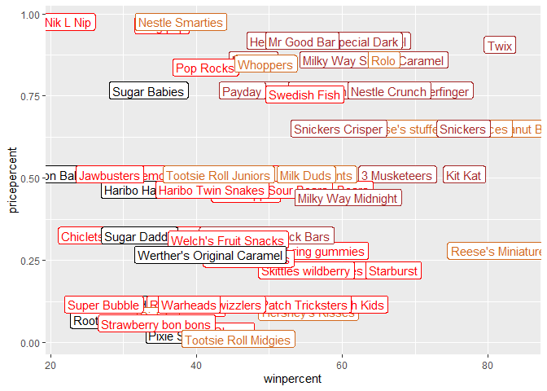

There are just too many labels in this above plot to be readable. We can
use the `ggrepel` package to do a better job of placing labels so they
minimize text overlap.

``` r
library(ggrepel)

ggplot(candy) + aes(winpercent, pricepercent, label = rownames(candy)) + geom_point(col = my_cols) + geom_text_repel(col = my_cols, size = 3.3, max.overlaps = 5)
```

    Warning: ggrepel: 54 unlabeled data points (too many overlaps). Consider
    increasing max.overlaps

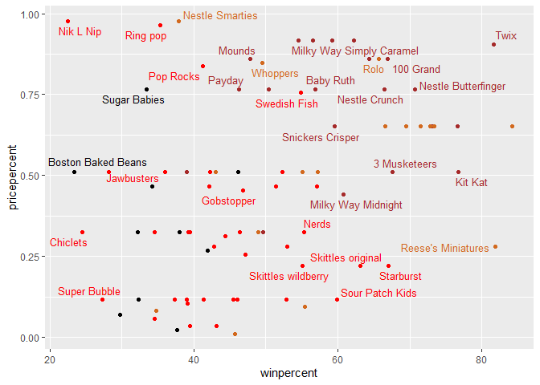

## 5 Exploring the correlation structure

``` r
library(corrplot)
```

    corrplot 0.92 loaded

``` r
cij <- cor(candy)
head(cij)
```

                      chocolate     fruity     caramel peanutyalmondy      nougat
    chocolate         1.0000000 -0.7417211  0.24987535     0.37782357  0.25489183
    fruity           -0.7417211  1.0000000 -0.33548538    -0.39928014 -0.26936712
    caramel           0.2498753 -0.3354854  1.00000000     0.05935614  0.32849280
    peanutyalmondy    0.3778236 -0.3992801  0.05935614     1.00000000  0.21311310
    nougat            0.2548918 -0.2693671  0.32849280     0.21311310  1.00000000
    crispedricewafer  0.3412098 -0.2693671  0.21311310    -0.01764631 -0.08974359
                     crispedricewafer       hard        bar   pluribus sugarpercent
    chocolate              0.34120978 -0.3441769  0.5974211 -0.3396752   0.10416906
    fruity                -0.26936712  0.3906775 -0.5150656  0.2997252  -0.03439296
    caramel                0.21311310 -0.1223551  0.3339600 -0.2695850   0.22193335
    peanutyalmondy        -0.01764631 -0.2055566  0.2604196 -0.2061093   0.08788927
    nougat                -0.08974359 -0.1386750  0.5229764 -0.3103388   0.12308135
    crispedricewafer       1.00000000 -0.1386750  0.4237509 -0.2246934   0.06994969
                     pricepercent winpercent
    chocolate           0.5046754  0.6365167
    fruity             -0.4309685 -0.3809381
    caramel             0.2543271  0.2134163
    peanutyalmondy      0.3091532  0.4061922
    nougat              0.1531964  0.1993753
    crispedricewafer    0.3282654  0.3246797

``` r
corrplot(cij)
```


> Q22. Examining this plot what two variables are anti-correlated (have
> minus values)?

Fruity and chocolate

> Q23. Similary, what two variables are most positively correlated?

Chocolate and bar,chocolate and the winpercentage, and chocolate and the
price percentage tend to be positive correlated.

## 6. Principal Component Analysis

We will perform a PCA of the candy. Key-question: do we need to scale
the data before PCA?

Yes

``` r
pca <- prcomp(candy, scale = TRUE)
summary(pca)
```

    Importance of components:
                              PC1    PC2    PC3     PC4    PC5     PC6     PC7
    Standard deviation     2.0788 1.1378 1.1092 1.07533 0.9518 0.81923 0.81530
    Proportion of Variance 0.3601 0.1079 0.1025 0.09636 0.0755 0.05593 0.05539
    Cumulative Proportion  0.3601 0.4680 0.5705 0.66688 0.7424 0.79830 0.85369
                               PC8     PC9    PC10    PC11    PC12
    Standard deviation     0.74530 0.67824 0.62349 0.43974 0.39760
    Proportion of Variance 0.04629 0.03833 0.03239 0.01611 0.01317
    Cumulative Proportion  0.89998 0.93832 0.97071 0.98683 1.00000

``` r
plot(pca$x[,1], pca$x[,2], col = my_cols, pch = 16)
```

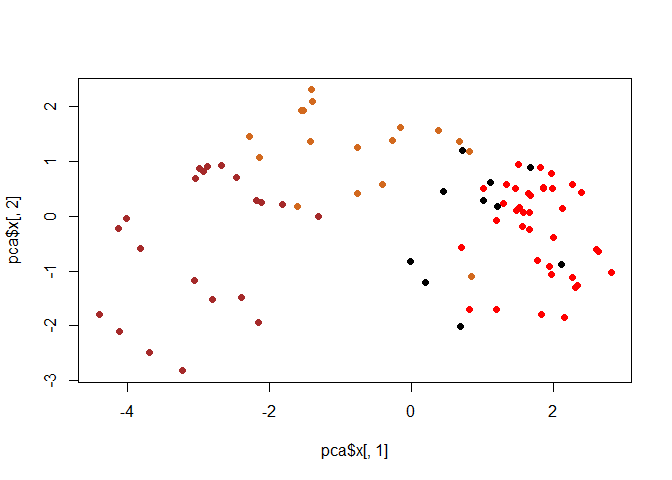

Make a ggplot version of this figure:

``` r
#Make a new dataframe with out PCA results and candy data
my_data <- cbind(candy, pca$x[,1:2])
head(my_data)
```

                 chocolate fruity caramel peanutyalmondy nougat crispedricewafer
    100 Grand            1      0       1              0      0                1
    3 Musketeers         1      0       0              0      1                0
    One dime             0      0       0              0      0                0
    One quarter          0      0       0              0      0                0
    Air Heads            0      1       0              0      0                0
    Almond Joy           1      0       0              1      0                0
                 hard bar pluribus sugarpercent pricepercent winpercent        PC1
    100 Grand       0   1        0        0.732        0.860   66.97173 -3.8198617
    3 Musketeers    0   1        0        0.604        0.511   67.60294 -2.7960236
    One dime        0   0        0        0.011        0.116   32.26109  1.2025836
    One quarter     0   0        0        0.011        0.511   46.11650  0.4486538
    Air Heads       0   0        0        0.906        0.511   52.34146  0.7028992
    Almond Joy      0   1        0        0.465        0.767   50.34755 -2.4683383
                        PC2
    100 Grand    -0.5935788
    3 Musketeers -1.5196062
    One dime      0.1718121
    One quarter   0.4519736
    Air Heads    -0.5731343
    Almond Joy    0.7035501

``` r
ggplot(my_data, aes(PC1, PC2, label = rownames(my_data))) + geom_point(col = my_cols) + geom_text_repel(col = my_cols, max.overlaps = 5)
```

    Warning: ggrepel: 56 unlabeled data points (too many overlaps). Consider
    increasing max.overlaps

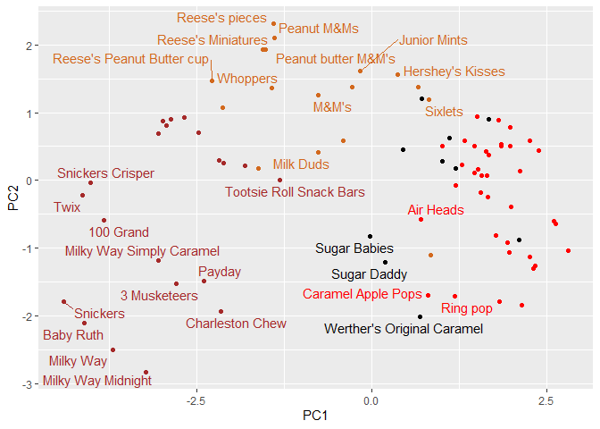

Make this a bit nicer.

``` r
p <- ggplot(my_data, aes(PC1, PC2, size = winpercent/100, label = rownames(my_data))) + geom_point(col = my_cols) + geom_text_repel(col = my_cols, max.overlaps = 5)
p
```

    Warning: ggrepel: 66 unlabeled data points (too many overlaps). Consider
    increasing max.overlaps

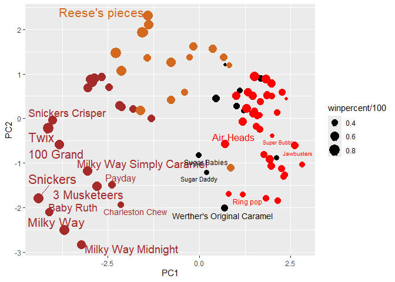

``` r
p + geom_text_repel(size=3.3, col=my_cols, max.overlaps = 5)  + 
  theme(legend.position = "none") +
  labs(title="Halloween Candy PCA Space",
       subtitle="Colored by type: chocolate bar (dark brown), chocolate other (light brown), fruity (red), other (black)",
       caption="Data from 538")
```

    Warning: ggrepel: 64 unlabeled data points (too many overlaps). Consider
    increasing max.overlaps

    Warning: ggrepel: 55 unlabeled data points (too many overlaps). Consider
    increasing max.overlaps

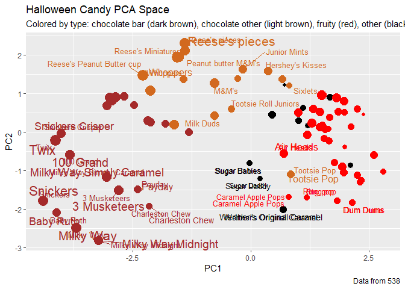

``` r
#library(plotly)
#ggplotly(p)
```

How do the original variables contribute to our PCs? For this we look at
the loading component of our results object, i.e. the `pca$rotation`
object.

``` r
head(pca$rotation)
```

                            PC1         PC2         PC3          PC4         PC5
    chocolate        -0.4019466  0.21404160  0.01601358 -0.016673032  0.06603585
    fruity            0.3683883 -0.18304666 -0.13765612 -0.004479829  0.14353533
    caramel          -0.2299709 -0.40349894 -0.13294166 -0.024889542 -0.50730150
    peanutyalmondy   -0.2407155  0.22446919  0.18272802  0.466784287  0.39993025
    nougat           -0.2268102 -0.47016599  0.33970244  0.299581403 -0.18885242
    crispedricewafer -0.2215182  0.09719527 -0.36485542 -0.605594730  0.03465232
                             PC6         PC7        PC8          PC9        PC10
    chocolate        -0.09018950 -0.08360642 -0.4908486 -0.151651568  0.10766136
    fruity           -0.04266105  0.46147889  0.3980580 -0.001248306  0.36206250
    caramel          -0.40346502 -0.44274741  0.2696345  0.019186442  0.22979901
    peanutyalmondy   -0.09416259 -0.25710489  0.4577145  0.381068550 -0.14591236
    nougat            0.09012643  0.36663902 -0.1879396  0.385278987  0.01132345
    crispedricewafer -0.09007640  0.13077042  0.1356774  0.511634999 -0.26481014
                           PC11       PC12
    chocolate         0.1004528 0.69784924
    fruity            0.1749490 0.50624242
    caramel           0.1351582 0.07548984
    peanutyalmondy    0.1124428 0.12972756
    nougat           -0.3895447 0.09223698
    crispedricewafer -0.2261562 0.11727369

Make a barplot with ggplot and order the bars by their value. Recall
that you need a data.frame as input for ggplot.

``` r
res <- pca$rotation
ggplot(res, aes(PC1, reorder(rownames(res), PC1))) + geom_col()
```

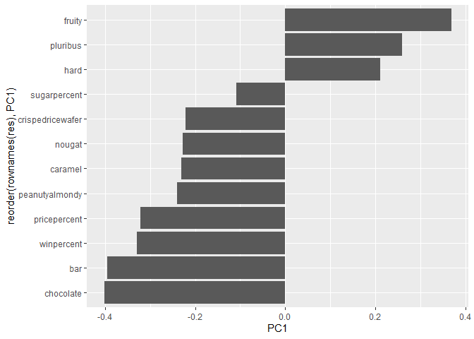

> Q24. What original variables are picked up strongly by PC1 in the
> positive direction? Do these make sense to you?

Fruit, pluribus, and hard are all the variables that are found to be in
the positive direction. These are reflective on the correlation
structure in the dataset, in which fruity candy, hard type, and pluribus
tend to appear together.
