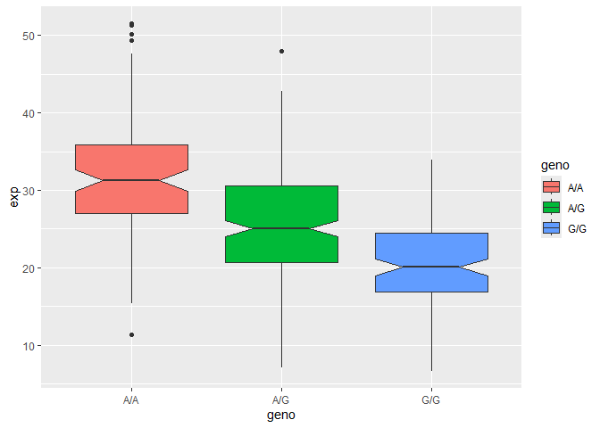

# Class 11 Lab Session
Yvonne Yu A16333006

### Section 4 of the PDF: Population Scale Analysis

> Q13. Read this file into R and determine the sample size for each
> genotype and their corresponding median expression levels for each of
> these genotypes.

``` r
expr <- read.table("rs8067378_ENSG00000172057.6.txt")
head(expr)
```

       sample geno      exp
    1 HG00367  A/G 28.96038
    2 NA20768  A/G 20.24449
    3 HG00361  A/A 31.32628
    4 HG00135  A/A 34.11169
    5 NA18870  G/G 18.25141
    6 NA11993  A/A 32.89721

The following shows a breakdown of the sample size for each genotype.

``` r
table(expr$geno)
```


    A/A A/G G/G 
    108 233 121 

Pulls the package that would be used.

``` r
library(dplyr)
```


    Attaching package: 'dplyr'

    The following objects are masked from 'package:stats':

        filter, lag

    The following objects are masked from 'package:base':

        intersect, setdiff, setequal, union

The following code gives the summary information for each of the
genotypes, which can be used to identify the median.

``` r
# The function takes the target input genotype and prints out the genotype
# and the associated summary
geno_info <- function(gen) {
  
  # prints out the genotype inputted
  print(gen)
  
  # filters out the dataframe to only the sample size with that genotype
  new_expr <- expr %>% filter(geno == gen) 
  
  # prints out the summary of the dataframe 
  print(summary(new_expr))
}

# the list of the genotypes in the dataframe
geno_list <- unique(expr$geno)

# test run
for(i in geno_list) {
  geno_info(i)
}
```

    [1] "A/G"
        sample              geno                exp        
     Length:233         Length:233         Min.   : 7.075  
     Class :character   Class :character   1st Qu.:20.626  
     Mode  :character   Mode  :character   Median :25.065  
                                           Mean   :25.397  
                                           3rd Qu.:30.552  
                                           Max.   :48.034  
    [1] "A/A"
        sample              geno                exp       
     Length:108         Length:108         Min.   :11.40  
     Class :character   Class :character   1st Qu.:27.02  
     Mode  :character   Mode  :character   Median :31.25  
                                           Mean   :31.82  
                                           3rd Qu.:35.92  
                                           Max.   :51.52  
    [1] "G/G"
        sample              geno                exp        
     Length:121         Length:121         Min.   : 6.675  
     Class :character   Class :character   1st Qu.:16.903  
     Mode  :character   Mode  :character   Median :20.074  
                                           Mean   :20.594  
                                           3rd Qu.:24.457  
                                           Max.   :33.956  

> Q14.Generate a boxplot with a box per genotype, what could you infer
> from the relative expression value between A/A and G/G displayed in
> this plot? Does the SNP effect the expression of ORMDL3?

Pulls the package that would be utilized for this question.

``` r
library(ggplot2)
```

The following code is used to generate a boxplot that shows the
distribution of expression for each of the genotypes.

``` r
ggplot(expr, aes(geno, exp, fill = geno)) + geom_boxplot(notch = TRUE)
```



Based on the boxplot, it can be inferred that the A/A genotype is
expressed more, followed by the A/G genotype, and the G/G genotype being
the least expressed of the three. Therefore, this would mean that the
SNP genotype can affect the ORMDL3 expression levels.
